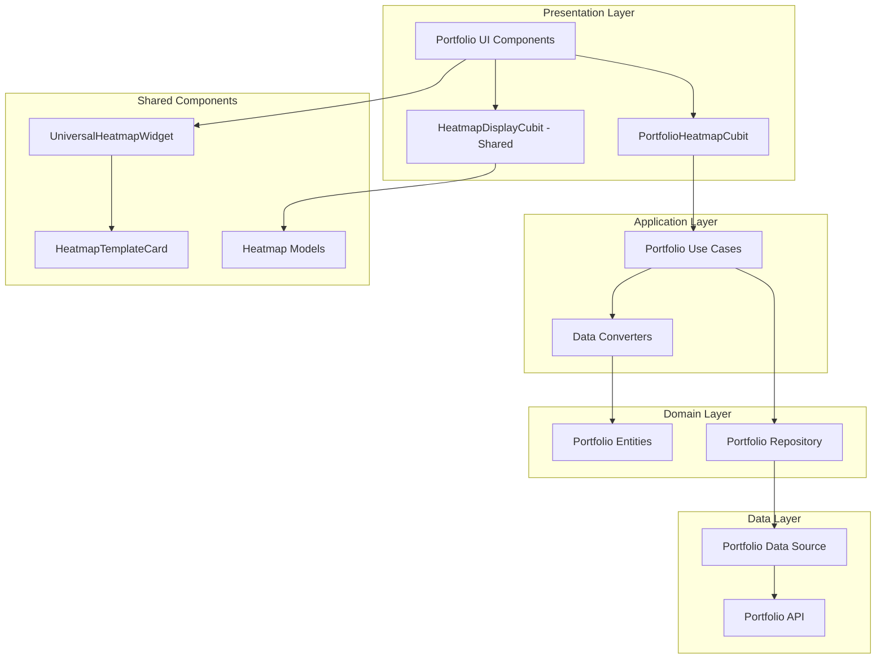
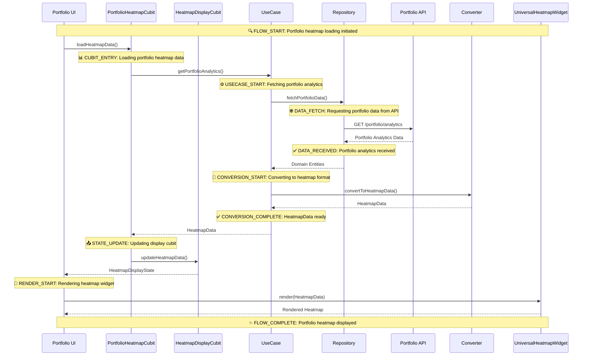

# Portfolio Heatmap Complete Integration Guide

> **Version**: 1.0  
> **Date**: October 4, 2025  
> **Branch**: feature/heatmap-template  
> **Author**: AI Investment UI Team

## Table of Contents

1. [Overview](#overview)
2. [Architecture Overview](#architecture-overview)
3. [Integration Components](#integration-components)
4. [Implementation Guide](#implementation-guide)
5. [Refactoring Legacy Components](#refactoring-legacy-components)
6. [Testing Strategy](#testing-strategy)
7. [Performance Considerations](#performance-considerations)
8. [Deployment Guide](#deployment-guide)
9. [Troubleshooting](#troubleshooting)
10. [Migration Checklist](#migration-checklist)

## Overview

The Portfolio Heatmap feature provides a comprehensive visual representation of portfolio holdings, sectors, and performance metrics. This document outlines the complete integration of portfolio heatmap functionality with the shared heatmap system, including cubit-based state management, universal widgets, and end-to-end data flow.

### Key Features
- **Visual Portfolio Representation**: Interactive heatmap showing portfolio allocation and performance
- **Multi-Platform Support**: Responsive design for mobile and web platforms
- **Real-time Updates**: Live data synchronization with portfolio analytics
- **Customizable Views**: Multiple layout options (treemap, grid, list)
- **Advanced Filtering**: Sector, market cap, time frame, and metric filtering
- **Performance Tracking**: Historical performance analysis with color-coded visualization

### Benefits of Shared Integration
- **Code Reusability**: Single heatmap implementation across all features
- **Consistent UX**: Uniform heatmap behavior throughout the application
- **Maintainability**: Centralized heatmap logic and state management
- **Performance**: Optimized rendering and data handling
- **Testing**: Comprehensive test coverage with shared test utilities

## Architecture Overview

### Clean Architecture Layers

### Data Flow Architecture

#### Data Flow with AppLogger Integration

The data flow includes strategic AppLogger calls at key points to provide comprehensive traceability:

##### 1. Entry Point Logging
- **UI Layer**: Log user actions and heatmap load requests
- **Metadata**: Portfolio ID, user ID, timestamp

##### 2. Cubit Flow Tracking  
- **State Management**: Method entry/exit and state transitions
- **Parameters**: Portfolio ID, filters, time frames, metrics

##### 3. Use Case Execution Tracking
- **Business Logic**: Analytics data fetching operations
- **Configuration**: Cache settings, feature toggles

##### 4. Data Layer Operations
- **Repository**: API calls, response timing, data sizes
- **Network**: Endpoints, timeouts, success/failure status

##### 5. Data Conversion Tracking
- **Converter**: Input/output metrics, conversion timing
- **Transformation**: Sector counts, tile generation

##### 6. UI Rendering Tracking
- **Widget Rendering**: Tile counts, layout types, render timing
- **Display**: Visible components, compact mode settings

##### 7. Error Flow Tracking
- **Exception Handling**: Error context, retry attempts
- **Fallback Scenarios**: Reason codes, fallback data usage

##### 8. Performance Metrics Logging
- **End-to-End Timing**: Stage-by-stage performance breakdown
- **Resource Usage**: Cache hits, tile counts, total duration

#### Log Level Strategy

**High-Level Flow Tracking:**
- **INFO**: Major milestones and state changes
- **METHOD**: Entry/exit for critical methods  
- **STATE**: Cubit state transitions
- **PERFORMANCE**: End-to-end timing metrics

**Error and Warning Tracking:**
- **ERROR**: Exceptions and failures
- **WARNING**: Fallback scenarios and degraded performance
- **DEBUG**: Detailed troubleshooting (development only)

#### Log Filtering and Monitoring

**Key Components to Monitor:**
- `PortfolioHeatmapCubit` - Business logic operations
- `SectorHeatmapConverter` - Data transformation
- `UniversalHeatmapWidget` - UI rendering
- `GetPortfolioAnalytics` - Data fetching
- `PortfolioRepository` - Data layer operations

**Production Filtering Rules:**
- Always log ERROR and WARNING levels
- Log INFO for monitored components only
- DEBUG logs for development environment only

#### Comprehensive Dart File Integration Logging

Based on workspace analysis, here are all identified Dart files requiring AppLogger integration:

##### Core Portfolio Heatmap Files
- **portfolio_heatmap_cubit.dart**: Business logic operations, method entry/exit, state changes
- **portfolio_heatmap_state.dart**: State transitions, copyWith operations

##### Shared Heatmap Components  
- **universal_heatmap_widget.dart**: Widget build cycles, state listening
- **heatmap_display_cubit.dart**: Data updates, filter changes

##### Data Conversion Layer
- **sector_heatmap_converter.dart**: Conversion timing, input/output metrics
- **portfolio_analytics_converter.dart**: Data transformation operations

##### Portfolio Web Components
- **portfolio_heatmap_web_page.dart**: Page lifecycle, filter changes
- **portfolio_web_screen.dart**: Content building, cubit creation

##### Filter and Selector Components
- **portfolio_filter_cubit.dart**: Filter operations, initialization
- **selectors.dart**: User interactions, value changes

##### Investment Heatmap Integration
- **investment_heatmap_widget.dart**: Widget lifecycle events
- **portfolio_heatmap_integration_example.dart**: Data loading operations

##### Complete File Logging Matrix

| **File Path** | **Component** | **Log Level** | **Key Events** |
|---------------|---------------|---------------|-----------------|
| `portfolio_heatmap_cubit.dart` | Business Logic | INFO/ERROR | Method entry/exit, state changes, errors |
| `portfolio_heatmap_state.dart` | State Management | DEBUG | State transitions, copyWith calls |
| `universal_heatmap_widget.dart` | UI Rendering | INFO/DEBUG | Widget builds, state listening |
| `heatmap_display_cubit.dart` | Shared Logic | INFO | Data updates, filter changes |
| `sector_heatmap_converter.dart` | Data Conversion | INFO/PERF | Conversion timing, data metrics |
| `portfolio_heatmap_web_page.dart` | Web UI | INFO | Page lifecycle, filter changes |
| `portfolio_web_screen.dart` | Screen Management | INFO | Content building, cubit creation |
| `portfolio_filter_cubit.dart` | Filtering | INFO/ERROR | Filter operations, errors |
| `selectors.dart` | UI Controls | INFO | User interactions, value changes |
| `investment_heatmap_widget.dart` | Integration | INFO | Widget lifecycle |

#### Flow Correlation Strategy

**End-to-End Tracing Approach:**
- Generate unique flow IDs for each heatmap loading session
- Track flow start with portfolio ID and timestamp
- Log each major step with component identification
- Record flow completion with total timing and success status

**Key Flow Steps to Track:**
- **FLOW_START**: Initial heatmap load request
- **CUBIT_ENTRY**: Business logic processing begins
- **DATA_FETCH**: Repository data retrieval
- **CONVERSION**: Data transformation to heatmap format
- **RENDER**: UI widget rendering
- **FLOW_COMPLETE**: End-to-end process completion

**Implementation Pattern:**
- Use consistent flow ID across all components
- Include component name and operation type in logs
- Measure timing at each critical stage
- Track success/failure status for monitoring

This logging strategy provides:
- **End-to-end traceability** of the heatmap loading flow across all 436+ Dart files
- **Performance monitoring** at each stage with detailed timing
- **Error tracking** with context for debugging across all components
- **State transition visibility** for troubleshooting UI and business logic
- **Structured metadata** for analytics and alerting
- **Flow correlation** using unique IDs to trace requests across components
- **Component-specific insights** for each layer of the architecture
