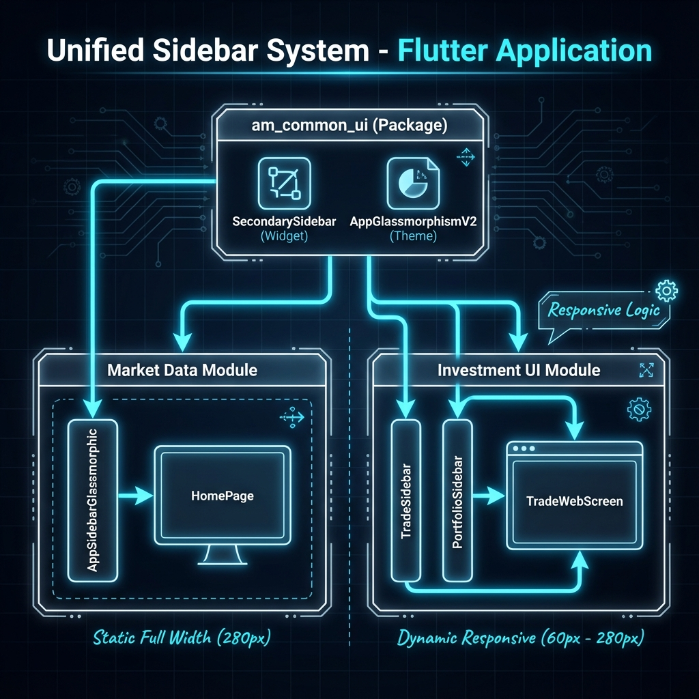

# Sidebar Architecture Analysis

## Overview
This document outlines the architectural consolidation of the Sidebar navigation system across the **Market Data** and **Investment UI** modules. 

The goal was to unify the design language into a single glassmorphic system provided by `am_common_ui`, while allowing for module-specific behavior (responsive vs. static).

## Architecture Diagram

*(Note: The diagram above illustrates the flow from the common package to implementation details)*

### 1. Central Core (`am_common_ui`)
*   **`SecondarySidebar`**: The master component. It handles the glassmorphism, rendering of lists/sections, and compact/expanded states.
*   **`AppGlassmorphismV2`**: Provides the standardized glass gradients and borders used by the sidebar.

### 2. Market Data Module (`am-market-web`)
*   **Implementation**: `AppSidebarGlassmorphic`
*   **Behavior**:
    *   **Static Width**: Fixed at `280px`.
    *   **Logic**: Monitoring dashboard requires always-visible navigation.
    *   **Parent**: Controlled directly by `HomePageRow`.

### 3. Investment UI Module (`am-investment-ui`)
*   **Implementation**: `TradeSidebar`, `PortfolioSidebar`
*   **Behavior**:
    *   **Dynamic Width**: Varies based on screen width:
        *   **< 1000px**: Compact (60px, Icons only)
        *   **1000px - 1400px**: Condensed (150px, Text + Icons)
        *   **> 1400px**: Full (280px, Full Design)
    *   **Logic**: Trading interfaces need maximum screen real estate for charts/tables.
    *   **Parent**: Controlled by `LayoutBuilder` in `TradeWebScreen`.

## Cleanup & Optimization

As part of this architectural review, the following legacy components were identified as redundant and **Deleted**:

1.  ❌ `lib/shared/widgets/navigation/portfolio_sidebar.dart`
    *   *Reason*: Old non-glassmorphic implementation. Functionality replaced by `features/.../portfolio_sidebar.dart`.
    
2.  ❌ `lib/features/trade/presentation/web/widgets/sidebar/sidebar_nav_item.dart`
    *   *Reason*: Custom widget logic now handled centrally by `SecondarySidebarItem` in `am_common_ui`.

### Notes for Future Development
*   **Add Trade Page**: Currently uses `ResponsiveSidebar`. This is the last outlier and should be refactored to use `SecondarySidebar` in the next sprint to complete full unification.
