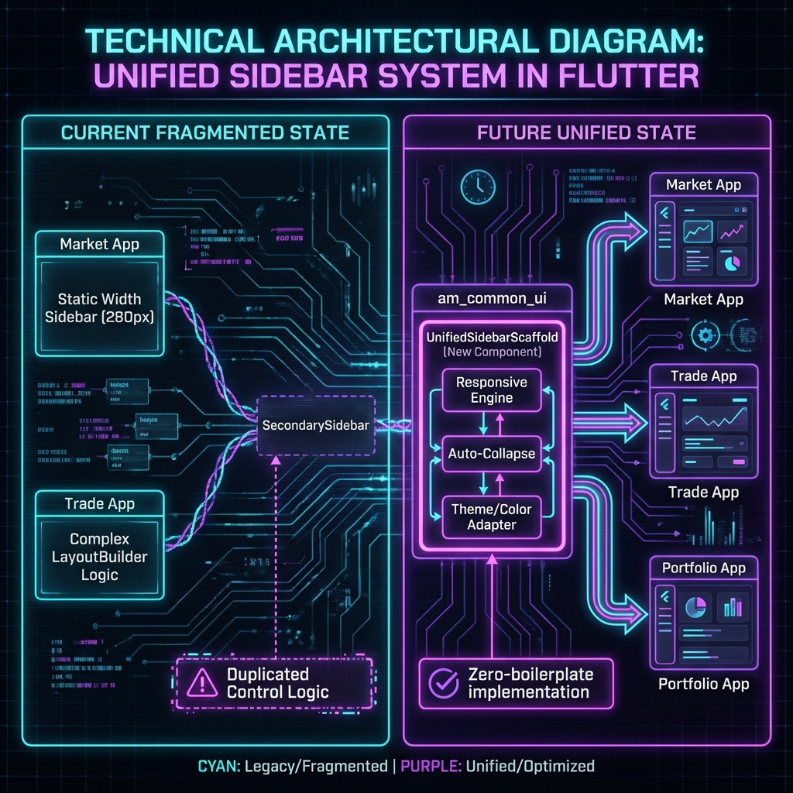

# Sidebar Unification Implementation Plan

## Executive Summary
This document outlines the strategy to standardize the sidebar experience across **Market**, **Trade**, and **Portfolio** applications. 
The core objective is to move all "responsive control logic" (auto-hide, width calculation, animation) from individual modules into a reusable `UnifiedSidebarScaffold` within `am_common_ui`.

## The Vision
**One Scaffold to rule them all.** 
Modules should no longer manually calculate widths or handle `LayoutBuilder`. They should simply provide their content and a list of navigation items.



## Component Architecture

### 1. New Component: `UnifiedSidebarScaffold` (in `am_common_ui`)
This will be the central controller.
*   **Responsibility**:
    *   **Auto-Responsive**: Automatically detects screen width and switches between Drawer (Mobile), Compact (Tablet), and Full (Desktop) modes.
    *   **Animation**: Handles smooth width transitions (60px -> 280px).
    *   **Theme Adapter**: Standardizes how colors are applied.
        *   *Mode A (Launcher)*: Colorful items (Market style).
        *   *Mode B (Workspace)*: Uniform accent color (Trade style).

*   **API Structure**:
    ```dart
    UnifiedSidebarScaffold(
      // Configuration
      appName: "Market Data",
      appIcon: Icons.trending_up,
      activeUrl: '/current-route',
      
      // Theming
      mode: SidebarMode.launcher, // or .workspace
      accentColor: Colors.cyan, // Fallback/Uniform color
      
      // Content
      body: PageContentWidget(),
      
      // Navigation Data
      groups: [
         SidebarGroup(title: "Main", items: [...]),
         SidebarGroup(title: "Analysis", items: [...]),
      ],
    )
    ```

### 2. Migration Strategy

#### Phase 1: Create the Core (am_common_ui)
*   Create `UnifiedSidebarScaffold.dart`.
*   Implement the `LayoutBuilder` and `AnimationController` logic currently found in `ResponsiveSidebar.dart`.
*   Integrate `SecondarySidebar` as the internal renderer.

#### Phase 2: Refactor Market Data
*   **Current**: `HomePage` uses a raw `Row` + `AppSidebarGlassmorphic` (Fixed 280px).
*   **Change**: Replace `Row` with `UnifiedSidebarScaffold`.
*   **Impact**: Market app will instantly gain "Compact Mode" capability on smaller screens, fixing the "launcher" feel.

#### Phase 3: Refactor Investment UI (Trade & Portfolio)
*   **Current**: `TradeWebScreen` uses complex `LayoutBuilder` logic to resize `TradeSidebar`.
*   **Change**: Delete custom `LayoutBuilder`. Wrap `TradeWebScreen` content in `UnifiedSidebarScaffold`.
*   **Impact**: Deletes ~200 lines of boilerplate code from the app layer. Ensures identical behavior to Market.

## Design Unification
To achieve the user's request of "Launcher Design" + "Responsive Behavior":
1.  **Market App**: Will keep its colorful items but gain the ability to collapse to icons.
2.  **Trade/Portfolio**: Will keep their sectioned structure but use the same animation curves as Market.
3.  **Visual Polish**: All sidebars will share the exact same Glassmorphism constants (`AppGlassmorphismV2`).

## Next Actions
1.  **Approval**: User to review this plan and diagram.
2.  **Execution**: Begin by creating `UnifiedSidebarScaffold` in `am_common_ui`.
